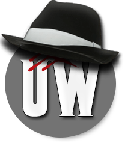
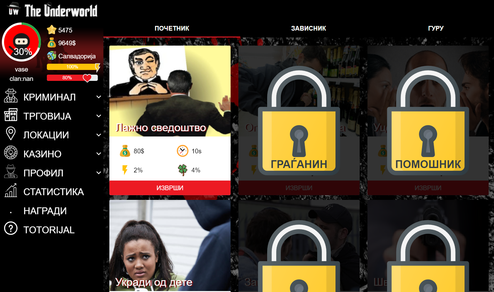

<!-- PROJECT LOGO -->
 

  

  <h3 align="center">The Underworld</h3>

  

    Nothing personal, it’s just business
  

<!-- TABLE OF CONTENTS -->

  
Table of Contents

  <ol>
    <li>
      <a href="#about-the-project">About The Project</a>
      <ul>
        <li><a href="#built-with">Built With</a></li>
      </ul>
    </li>
    <li><a href="#license">License</a></li>
    <li><a href="#contact">Contact</a></li>
  </ol>

<!-- ABOUT THE PROJECT -->
## About The Project

The Underworld is a web game about the Mafia. A game that offers a great time, socializing and rewards. A game that will simulate the real, everyday, criminal world.
Your goal is to earn as much money as possible, to have the most power, to become more influential and respected in this criminal world, to carry out all the given missions. 
Your experience will bring you to the top in this mafia world.

### Built With

* [Bootstrap](https://getbootstrap.com)
* [JQuery](https://jquery.com)
* [Laravel](https://laravel.com)
* [Slim](https://www.slimframework.com)
* [PHPMailer](https://github.com/PHPMailer/PHPMailer)

<!-- LICENSE -->
## License

Distributed under the MIT License. See `LICENSE` for more information.

<!-- CONTACT -->
## Contact

Vase Trendafilov - [@TrendafilovVase](https://twitter.com/TrendafilovVase) - vasetrendafilov@gmail.com

Project Link: [https://github.com/vasetrendafilov/the_underworld](https://github.com/vasetrendafilov/the_underworld)
